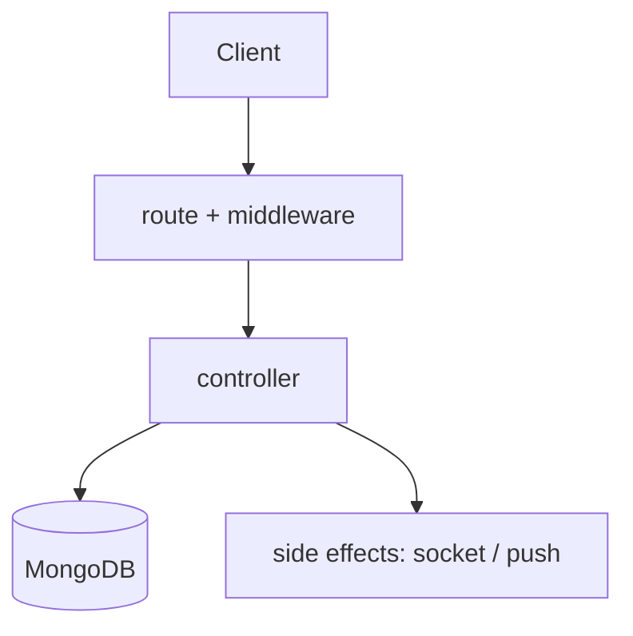

# <MODULE NAME> — TrackMe Backend

> **Copy this file to `docs/modules/<NAME>.md` when documenting a module.**
> Delete this quote block and every `<…>` placeholder. Keep the section order —
> `CLAUDE.md` and `docs/README.md` assume it.
>
> This is the **backend variant** of the module template. The client apps use a
> screens/hooks/api shape; here the spine is **route → middleware → controller → model**,
> plus side effects (socket emits, push, external APIs). Terse, senior-engineer tone.

**Status:** `<PLANNED | IN-PROGRESS | SHIPPED | SHIPPED-REGRESSION | DEPRECATED>` — <one line; if not SHIPPED, say what's missing/broken and link the tracking todo or audit>

**Consumed by:** <user-app / driver-app / web-admin — and which module doc over there>

---

## 1. Purpose

<2–4 sentences: what this module is responsible for, and the one hard constraint that shapes it
(security rule, data invariant, third-party limit).>

## 2. API surface

| Method | Path | Auth | Controller fn | Notes |
|---|---|---|---|---|
| `GET` | `/api/…` | `protect` / `requireManager` / public | `xController.fn` | <…> |

> Auth column must name the actual middleware from `src/middleware/auth.js`
> (`protect`, `optionalAuth`, `requireRoles`, `requireDriver`, `requireUser`, `requireAdmin`,
> `requireManager`, `requireSuperAdmin`). "Public" means no middleware — say so explicitly.

## 3. Key files (one job each)

| File | Responsibility |
|---|---|
| `src/routes/<x>Routes.js` | Route table + which middleware guards each endpoint. |
| `src/controllers/<x>Controller.js` | Request handling, validation, orchestration. No business logic in routes. |
| `src/models/<X>.js` | Schema, indexes, invariants. |
| `src/utils/<x>.js` | Pure helpers (crypto, geo, formatting). |
| `src/middleware/…` | Any module-specific guard/validator. |

## 4. Data model

| Model | Key fields | Indexes / invariants |
|---|---|---|
| `<X>` | <fields that matter> | <unique keys, TTL, compound indexes, "must always" rules> |

<Call out anything a migration depends on, and any field the client apps read by name.>

## 5. Request flow

<Replace with the real flow. Show the failure branches that have distinct status codes.>

## 6. Authorization & security rules

- <who may call this, and how it is enforced — ownership checks, role checks, scoping>
- <rate limits / lockouts / attempt counters>
- <what is deliberately NOT trusted from the client>

> Enforcement must be server-side. If a client hides a control, that is UX, not security.

## 7. Side effects

| Effect | Trigger | Detail |
|---|---|---|
| Socket emit | <event> | `<event name>` → payload; consumed by <app>. |
| Push | <event> | via `utils/pushHelper.js`; `data.type` must match the client's tap-routing switch. |
| External API | <service> | <key handling, quota, failure mode> |

## 8. Not visible in the API surface

<Crypto, hashing, token versioning, lockout tiers, background jobs, seed/migration scripts,
env vars, index requirements — anything a caller can't infer from the endpoints. Delete only if
genuinely nothing.>

## 9. Known gotchas / regressions

- <sharp edges, footguns, deliberate trade-offs, live regressions with a link>

## 10. Tests covering this module

| Layer | File | What it locks |
|---|---|---|
| Unit | `tests/…` | <pure helpers> |
| Integration | `tests/integration/…` | <endpoint contracts + authz + error codes> |
| WS | `tests/integration/ws/…` | <socket auth + event payloads> |

See [`ADDING_A_TEST.md`](ADDING_A_TEST.md) and the
[`TESTING_GUIDE.md`](../TESTING_GUIDE.md) traceability row that must exist.

## 11. Change protocol

Any change to this module must:
1. Run this module's tests green as a baseline.
2. Implement **route → middleware → controller → model** (no business logic in routes).
3. Add/adjust tests for every changed behaviour, **including the authz failure cases**.
4. Re-run green (`npm run test:integration`, `npm test`).
5. Update **this doc** + the [`TESTING_GUIDE.md`](../TESTING_GUIDE.md) row, and append a
   [`CHANGES.md`](../CHANGES.md) entry before pushing.
6. **If a contract changed, update the consuming app's module doc too** (user-app / driver-app /
   web-admin) — a backend contract change is never backend-only.
