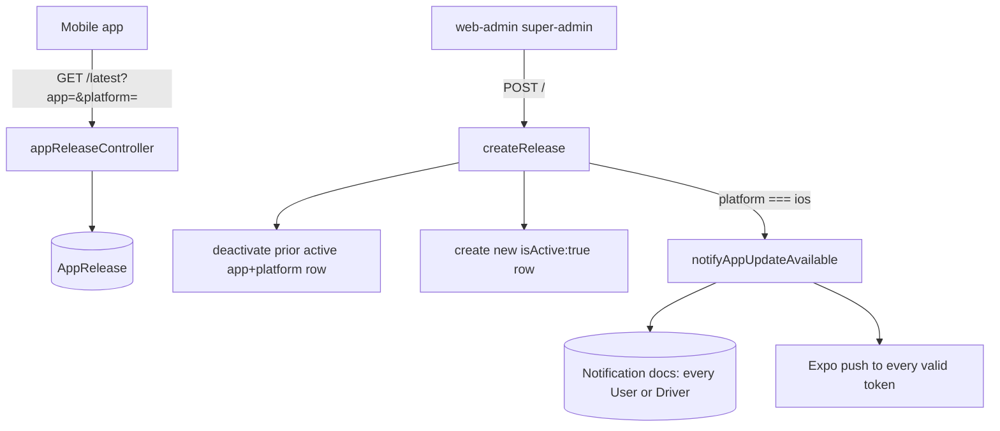

# APP RELEASES — TrackMe Backend

Version control for the mobile apps: lets `driver-app` and `user-app` ("rider") check for a newer
build, and lets a super-admin publish a new release from `web-admin`.

**Status:** `SHIPPED`

**Consumed by:** `driver-app` (in-app update check, Android only), `user-app`
(in-app update check, Android only), `web-admin` (super-admin publish/history UI).

---

## 1. Purpose

A single collection of release records, one per `(app, platform)` build published, with exactly
one `isActive:true` row per pair at a time. The mobile apps poll the public read endpoints to
learn whether a newer build exists; a super-admin publishes new rows from web-admin. The one hard
constraint: **iOS gets no in-app update check** — Apple's review process makes an in-app "download
this APK-equivalent" flow inappropriate — so an iOS publish instead fires a notification + push
telling iOS users to go find the update themselves (App Store / website).

## 2. API surface

| Method | Path | Auth | Controller fn | Notes |
|---|---|---|---|---|
| `GET` | `/api/app-releases` | Public | `appReleaseController.listLatest` | One row per `(app, platform)` — the latest `isActive:true` doc for each, at most 4 total. |
| `GET` | `/api/app-releases/latest?app=&platform=` | Public | `appReleaseController.getLatestForTarget` | 400 if `app`/`platform` missing or not in their enums. `{ release: null }` when nothing matches. |
| `GET` | `/api/app-releases/history?app=` | `protect` + `requireSuperAdmin` | `appReleaseController.listHistory` | ALL docs (active or not) for the app, newest first. 400 if `app` missing/invalid. |
| `POST` | `/api/app-releases` | `protect` + `requireSuperAdmin` | `appReleaseController.createRelease` | Publishes a release; deactivates the prior active one for the same `(app, platform)`. |
| `PATCH` | `/api/app-releases/:id` | `protect` + `requireSuperAdmin` | `appReleaseController.updateReleaseStatus` | Body `{ isActive }`. 404 if the id doesn't exist. |

## 3. Key files

| File | Responsibility |
|---|---|
| `src/routes/appReleaseRoutes.js` | Route table + auth guards. |
| `src/controllers/appReleaseController.js` | List/latest/history/create/status-toggle. |
| `src/models/AppRelease.js` | Schema, enums, compound index. |
| `src/utils/notificationHelper.js` | `notifyAppUpdateAvailable` — the iOS-publish notification/push hook. |

## 4. Data model

| Model | Key fields | Indexes / invariants |
|---|---|---|
| `AppRelease` | `app` (`driver`\|`rider`), `platform` (`android`\|`ios`), `version` (String, e.g. `"1.0.1"`), `versionCode` (Number — Android versionCode / iOS build number, placeholder for iOS since it drives no logic there), `downloadUrl`, `releaseNotes` (default `''`), `mandatory` (default `false`), `fileSizeBytes` (optional), `isActive` (default `true`) | Compound index `{ app: 1, platform: 1, isActive: 1 }`. Exactly one `isActive:true` doc per `(app, platform)` is an app-level invariant enforced by `createRelease` (it deactivates the prior one before inserting), **not** a unique index — a direct `AppRelease.create()` bypassing the controller could violate it. |

`app: 'rider'` is the `user-app` repo/consumer — named "rider" to match the domain's existing
terminology (`RiderProfile`), not "user".

## 5. Request flow

## 6. Authorization & security rules

- The two read endpoints mobile apps call (`GET /`, `GET /latest`) are **public, no auth** — an
  update check must work before/without a logged-in session.
- `GET /history`, `POST /`, and `PATCH /:id` are **super-admin only** (`protect` +
  `requireSuperAdmin` — a Manager ('admin' role) gets 403, same as every other super-admin-only
  surface in this backend). See `src/middleware/auth.js`.
- Input validation is manual (not express-validator, matching `vehicleReviewController.js`'s
  style): `app`/`platform` are checked against `AppRelease.APPS`/`AppRelease.PLATFORMS` before any
  DB write, `version`/`downloadUrl` must be non-empty strings, `versionCode` must be numeric.

## 7. Side effects

| Effect | Trigger | Detail |
|---|---|---|
| Notification docs | `POST /api/app-releases` with `platform: 'ios'` | `notifyAppUpdateAvailable({ app, version, downloadUrl })` creates one `APP_UPDATE_AVAILABLE` `Notification` per account in the target collection (`User` for `app:'rider'`, `Driver` for `app:'driver'`). `title: 'New version available'`, `priority: 'LOW'`, `data: { version, downloadUrl }`. |
| Expo push | same trigger | Every valid Expo token across those same accounts gets a push with matching `title`/`body`, using the same chunking/ticket-collection/error-swallowing style as `pushHelper.sendBoardingPush`. |

**The notification/push never blocks or fails the publish.** `createRelease` wraps the call in
try/catch and only logs on failure — a down Expo service or a notification-helper bug must not
stop a release from publishing.

**Known caveat — no platform filtering.** This fires for every account in the target collection
regardless of which platform (Android or iOS) that account's device actually runs, because stored
push tokens carry no platform field today. An Android user therefore also receives this
notification/push on an iOS release. This is harmless by design: Android users already get the
in-app automatic-update flow from `GET /latest`, so the extra push is redundant, not wrong.

## 8. Not visible in the API surface

- `AppRelease.APPS` / `AppRelease.PLATFORMS` are exported alongside the model (`module.exports.APPS`,
  `module.exports.PLATFORMS`) so the controller's validation and any script/seed stay in sync with
  the schema enum — don't hand-roll a second copy of these lists.
- `listLatest`'s "one per (app, platform)" result uses a `$sort` + `$group($first)` aggregation,
  not 4 separate queries — see `appReleaseController.listLatest`.
- iOS has no in-app automatic-update mechanism anywhere in this system; `versionCode` on an iOS row
  is a placeholder field with no consumer, kept only for schema symmetry with Android.

## 9. Known gotchas / regressions

- A manual `AppRelease.create()` bypassing `createRelease` (e.g. from a script) can leave two
  `isActive:true` rows for the same `(app, platform)` — nothing in the schema prevents it. Always
  publish through the controller/endpoint.
- The push/notification fan-out does a full collection scan of `User` or `Driver` with no
  pagination/batching beyond Expo's own `chunkPushNotifications`. Fine at current scale; revisit if
  either collection grows large enough for this to matter.

## 10. Tests covering this module

| Layer | File | What it locks |
|---|---|---|
| Integration | `tests/integration/app-releases.test.js` | Model validation (required fields, enum rejection); `GET /` returns only the latest active per `(app, platform)`; `GET /latest` 400s on bad/missing query params and returns `null` when nothing matches; `GET /history` requires super-admin + 400s on bad/missing `app`; `POST` requires super-admin (401/403 otherwise), validates required fields/enums, deactivates the prior active release for the same `(app, platform)` without disturbing other platforms, fires `notifyAppUpdateAvailable` for `platform:'ios'` only (mocked), and still 201s if the notification helper throws; `PATCH /:id` toggles `isActive` and 404s for an unknown id. |
| Integration | `tests/integration/app-release-notify.test.js` | `notifyAppUpdateAvailable` against the real DB + a mocked Expo SDK: creates one `Notification` per `User`/`Driver` account with the right `recipientRole`/`title`/`message`/`data`/`priority`; sends one push per valid Expo token across those accounts; returns `{ notified, sent: 0, skipped: 'NO_TOKENS' }` when nobody has a token; returns `{ notified: 0, sent: 0 }` when the target collection is empty. |

See [`ADDING_A_TEST.md`](../guides/ADDING_A_TEST.md) and the
[`TESTING_GUIDE.md`](../TESTING_GUIDE.md) traceability row that must exist.

## 11. Change protocol

See [`_MODULE_TEMPLATE.md`](../guides/_MODULE_TEMPLATE.md) §11. **This is a 4-way cross-repo
contract** (backend + driver-app + user-app + web-admin) — any shape change here must be
mirrored in all three consuming apps' module docs in the same change, not just this one.
