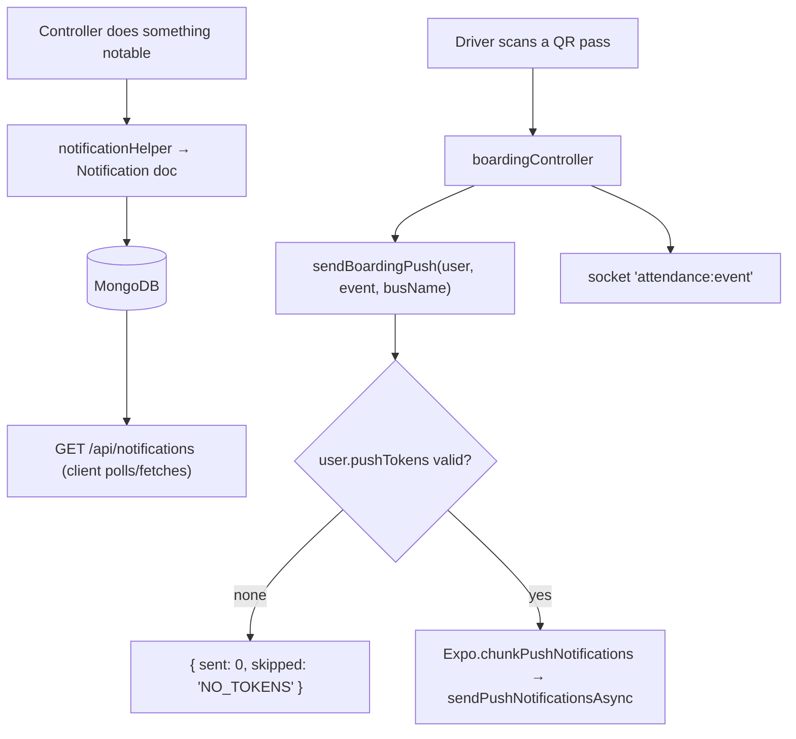

# NOTIFICATIONS — TrackMe Backend

Stored notification records, unread counts, device-token registration, and Expo push delivery.

**Status:** `SHIPPED` — with one important asymmetry: **there are two channels, and only one of
them pushes.** See §1.

**Consumed by:** `user-app`
([`NOTIFICATIONS.md`](../../../user-app/docs/modules/NOTIFICATIONS.md)), `driver-app`.

> Mined from the retired umbrella doc `docs/project/NOTIFICATIONS_DOCUMENTATION.md` and
> **re-verified against `src/`**. That doc was badly stale — it described three notification types
> where the model defines ten, and implied general push delivery that does not exist.

---

## 1. Purpose — and the two channels

Two things are called "notifications" here and they are **not the same pipeline**:

| Channel | What it is | Types | Reaches the device? |
|---|---|---|---|
| **Stored notifications** | `Notification` documents, read over REST, shown in the app's notification list + unread badge | **10** (see §4) | Only when the app fetches. No push. |
| **Expo push** | `utils/pushHelper.js` → Expo push service | **1** — `BOARDING_EVENT` | Yes, OS-level |

**`pushHelper.js` exports exactly one function, `sendBoardingPush`.** Nothing else in the codebase
sends a push. So a `ROUTE_ACCESS_APPROVED` notification is written to the database and appears in
the list next time the rider opens the app — it does **not** buzz their phone. If you are asked
"why didn't the user get notified", this asymmetry is almost always the answer.

## 2. API surface

All under `/api/notifications` (`src/routes/notificationRoutes.js`), all authenticated.

| Method | Path | Controller fn | Notes |
|---|---|---|---|
| `GET` | `/` | `getUserNotifications` | Paged list for the caller. |
| `GET` | `/count/unread` | `getUnreadCount` | Drives the bell badge. **Note the path shape** — not `/unread-count`. |
| `GET` | `/:notificationId` | `getNotificationById` | Single record. Not used by user-app today. |
| `POST` | `/device-token` | `registerDeviceToken` | Registers an Expo push token onto the account. |
| `PUT` | `/:notificationId/read` | `markAsRead` | **PUT**, not PATCH. |
| `PUT` | `/read-all` | `markAllAsRead` | **PUT**, not PATCH. |
| `DELETE` | `/:notificationId` | `deleteNotification` | |
| `DELETE` | `/admin/cleanup` | `cleanupOldNotifications` | Housekeeping; not a client call. Guarded by `requireAdmin` (`admin` or `super-admin` only). |

> `/read-all` is declared **after** `/:notificationId/read` but is a distinct literal path; keep
> literal routes ordered so `:notificationId` can't swallow them.

## 3. Key files

| File | Responsibility |
|---|---|
| `src/routes/notificationRoutes.js` | Route table. |
| `src/controllers/notificationController.js` | List, unread count, read/read-all, delete, device-token, cleanup. |
| `src/models/Notification.js` | Schema + the type enum + priority. |
| `src/utils/notificationHelper.js` | Creates `Notification` documents from other controllers. |
| `src/utils/pushHelper.js` | **Only** `sendBoardingPush` — Expo token filtering, chunking, ticket collection. |
| `src/controllers/boardingController.js` | The one caller of `sendBoardingPush`. |

## 4. Data model

`Notification.type` enum (10):

| Group | Types |
|---|---|
| Journey | `BUS_ARRIVAL`, `BUS_DEPARTURE`, `ROUTE_UPDATE` |
| Booking / payment | `BOOKING_CONFIRMATION`, `PAYMENT_SUCCESS` |
| **Private-route access** | `ROUTE_ACCESS_REQUEST`, `ROUTE_ACCESS_APPROVED`, `ROUTE_ACCESS_REJECTED`, `ROUTE_ACCESS_REVOKED` |
| System | `SYSTEM_ALERT` |

Priority: `HIGH` / `MEDIUM` (default). Push tokens live on the account as **`user.pushTokens`
(an array)** — a user may have several devices.

> **`BOARDING_EVENT` is not in this enum.** It exists only as `data.type` on the push payload.
> Don't look for it in the database.

## 5. Request / delivery flow

## 6. Authorization & security rules

- Every endpoint is authenticated; a caller only ever reads/mutates **their own** notifications.
- `POST /device-token` writes to the calling account — tokens are never assigned to another user.
- `DELETE /admin/cleanup` is guarded by `requireAdmin` (`admin`/`super-admin` only) — a rider or
  driver token gets `403`. It deletes expired `Notification` docs system-wide, not scoped to the
  caller. Covered by `tests/integration/notifications.test.js`.

## 7. Side effects

| Effect | Trigger | Detail |
|---|---|---|
| Expo push | boarding/alighting scan | `sendBoardingPush`; `data.type = 'BOARDING_EVENT'` plus `eventId`, `boardingType`, `routeId`, `busId`. |
| Socket | boarding/alighting scan | `attendance:event` — see [`REALTIME.md`](REALTIME.md). |
| Notification doc | various controllers | via `notificationHelper`. |

## 8. Not visible in the API surface

- **Tokens are validated and chunked.** `Expo.isExpoPushToken` filters invalid entries, then
  `chunkPushNotifications` batches — Expo rejects oversized batches. Don't hand-roll the send.
- **Push failures are swallowed.** `sendBoardingPush` catches, logs, and returns
  `{ sent: 0, error }`; it never throws into the boarding flow — a dead push service must not
  block recording attendance. The flip side: **a silent push failure looks like success**
  to the caller.
- **`{ sent: 0, skipped: 'NO_TOKENS' }`** is the normal result for a rider who never granted
  notification permission. Not an error.
- **Expo tickets are returned but not reconciled.** Nobody polls Expo receipts, so permanently
  invalid tokens are never pruned from `user.pushTokens`.

## 9. Known gotchas / regressions

- **The `ROUTE_ACCESS_*` family is stored-only.** A rider whose join request is approved or
  revoked gets a database row, not a push. If those should buzz, `pushHelper` needs a second
  sender — it currently has none.
- **`data.type` is a cross-repo contract.** user-app's `getNavigationTarget` switches on it and
  handles `BOOKING_CONFIRMATION`, `BUS_ARRIVAL`, `BUS_DEPARTURE`, `BOARDING_EVENT`; anything else
  falls through to the notification list. Adding a push type without a client case routes the tap
  nowhere useful.
- `PUT` (not `PATCH`) for both read endpoints, and `/count/unread` (not `/unread-count`) — both
  have been mis-documented before.

## 10. Tests covering this module

| Layer | File | What it locks |
|---|---|---|
| Integration | `tests/integration/push-helper.test.js` | token filtering, chunking, `NO_TOKENS` skip, error swallow |
| Integration | `tests/integration/…` | list/unread/read/read-all/delete contracts + per-user scoping |

## 11. Change protocol

See [`_MODULE_TEMPLATE.md`](../guides/_MODULE_TEMPLATE.md) §11. Adding a **push** type requires a
matching case in user-app's `getNavigationTarget` **and** a test, in the same change.
