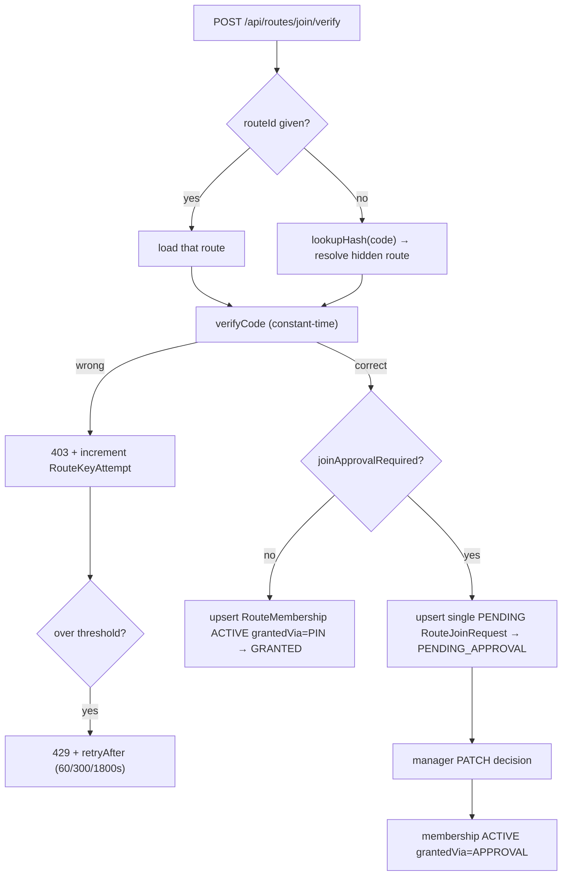

# PRIVATE ROUTES — TrackMe Backend

Room-key (6-digit PIN) verification, optional manager approval, and persistent per-user
membership for routes marked `PRIVATE` and optionally hidden.

**Status:** `SHIPPED` — backend and web-admin match every locked decision (per
[`FEATURE_AUDIT_REPORT.md`](../../../FEATURE_AUDIT_REPORT.md) §2). The only gap was a client-side
regression in user-app, since fixed.

**Consumed by:** `user-app` ([`docs/modules/PRIVATE_ROUTES.md`](../../../user-app/docs/modules/PRIVATE_ROUTES.md))
and `web-admin` (manager screens).

---

## 1. Purpose

Let a manager gate a route behind a rotating 6-digit room key, optionally hide it from listings
entirely, and optionally require manual approval before a rider may track it. The hard constraint:
**membership is the gate, and it is enforced server-side on both REST and websocket** — a client
that hides or reveals a control changes nothing about access.

## 2. API surface

### Rider
| Method | Path | Auth | Controller fn | Notes |
|---|---|---|---|---|
| `POST` | `/api/routes/join/verify` | `protect` | `routeAccessController.verifyRoomKey` | `{ routeId?, code }`. `routeId` omitted ⇒ hidden-route path, resolved from the code alone. |
| `GET` | `/api/routes/my-private` | `protect` | `routeAccessController.getMyPrivateRoutes` | ACTIVE memberships. |
| `GET` | `/api/routes/my-requests?status=` | `protect` | `routeAccessController.getMyJoinRequests` | The caller's own join requests. |
| `DELETE` | `/api/routes/:routeId/membership` | `protect` | `routeAccessController.leavePrivateRoute` | Drop own membership. |

### Manager
| Method | Path | Auth | Controller fn | Notes |
|---|---|---|---|---|
| `GET` | `/api/manager/routes/:routeId/join-requests?status=PENDING` | manager | `managerPrivateRoutesController.getRouteJoinRequests` | Scoped to the manager's own routes. |
| `PATCH` | `/api/manager/join-requests/:id/decision` | manager | `managerPrivateRoutesController.decideJoinRequest` | Approve/reject → creates or refuses membership. |

> Route ordering matters: `/join/verify`, `/my-private`, and `/my-requests` are declared **before**
> the generic `/:routeId` route in `routeRoutes.js`, or Express would swallow them as an id.

## 3. Key files (one job each)

| File | Responsibility |
|---|---|
| `src/routes/routeRoutes.js` | Rider-facing private-route endpoints + ordering above `/:routeId`. |
| `src/routes/managerRoutes.js` | Manager join-request listing + decision endpoints. |
| `src/controllers/routeAccessController.js` | Verify code, attempt counting, lockout, membership vs join-request branching. |
| `src/controllers/managerPrivateRoutesController.js` | Manager-side key reveal/rotate + approval decisions; scopes every query to `managerId === req.user._id`. |
| `src/utils/roomKey.js` | Crypto: `generateCode`, `encryptCode`, `decryptCode`, `lookupHash`, `verifyCode`. AES-256-GCM + HMAC lookup hash, constant-time verify. |
| `src/models/Route.js` | `visibility`, `isHidden`, `joinApprovalRequired`, encrypted `roomKey` fields. |
| `src/models/RouteMembership.js` | The access record. |
| `src/models/RouteJoinRequest.js` | Pending/approved/rejected requests. |
| `src/models/RouteKeyAttempt.js` | Brute-force attempt counter driving lockout. |
| `src/socket/socketHandler.js` | Re-checks membership before `join-route` / recent-locations on a PRIVATE route. |

## 4. Data model

| Model | Key fields | Indexes / invariants |
|---|---|---|
| `RouteMembership` | `userId`, `routeId`, `status: ACTIVE\|REVOKED`, `grantedVia: PIN\|APPROVAL`, timestamps | **`{ userId, routeId }` unique** — one membership per user per route, so retrying a code can never duplicate. Plus `{ routeId, status }`. |
| `RouteJoinRequest` | `userId`, `routeId`, status | Retrying a correct code on an approval-required route must **not** create duplicate PENDING rows. |
| `RouteKeyAttempt` | per user+route attempt count, lockout window | Drives the escalating lockout. |
| `Route` | `visibility`, `isHidden`, `joinApprovalRequired`, encrypted `roomKey` (`ciphertext`/`iv`/`authTag`) + HMAC lookup hash | The three flags are **independent**. Lookup hash exists so a code can find its route without decrypting every route. |

## 5. Request flow

## 6. Authorization & security rules

- Every rider endpoint requires `protect`. Membership is looked up from `req.user._id` — the
  client never supplies its own identity.
- **Manager scope:** every manager endpoint checks `managerId === req.user._id`; cross-manager
  access returns 403 and is covered by tests.
- **Room-key reveal/rotate is owner-only.**
- **Socket enforcement is independent of REST.** `socketHandler.js` re-checks `RouteMembership`
  before allowing `join-route` or `route:get-recent-locations` on a PRIVATE route. Fixing a UI bug
  never weakens this.
- **Brute force:** attempts are counted per user+route; lockout tiers escalate `[60, 300, 1800]`
  seconds and surface only as `retryAfter`.

## 7. Side effects

| Effect | Trigger | Detail |
|---|---|---|
| Membership row | correct code, no approval needed | `RouteMembership` ACTIVE, `grantedVia: 'PIN'`. |
| Join request | correct code, approval required | one PENDING `RouteJoinRequest` (idempotent on retry). |
| Membership row | manager approves | ACTIVE, `grantedVia: 'APPROVAL'`. |
| Notification | manager decision | rider is informed — see [`NOTIFICATIONS.md`](NOTIFICATIONS.md). |

## 8. Not visible in the API surface

- **Room keys are encrypted at rest** (AES-256-GCM: `ciphertext` + `iv` + `authTag`), never stored
  in plaintext. A separate **HMAC lookup hash** (peppered) lets a submitted code find its route
  without decrypting every candidate. `verifyCode` is constant-time.
- **Encryption key + pepper come from env** (`getEncryptionKey()` / `getPepper()`); rotating them
  invalidates existing keys. This is a deploy-time concern, not an API one.
- **`generateCode` retries up to 20 times** on lookup-hash collision before failing.
- **A migration backfills `visibility`/flags** for routes that predate the feature.
- The unique `{ userId, routeId }` index — not controller logic — is the real guarantee against
  duplicate memberships under concurrent requests.

## 9. Known gotchas / regressions

- Declaring a new `/api/routes/<literal>` endpoint **after** `/:routeId` silently breaks it. Add
  literals above.
- A correct code retried while a PENDING request exists must stay one request — assert this in
  tests when touching the branch.
- `isHidden` and `joinApprovalRequired` are independent; "hidden" does not imply "needs approval".
  The client's code-only entry path exists specifically because hidden routes are unlistable.
- The audit noted web-admin lacks a pending-count badge for "Private Routes" though the data
  exists — manager-UX gap, not functional.

## 10. Tests covering this module

| Layer | File | What it locks |
|---|---|---|
| Unit | `tests/…` | `roomKey` encrypt/decrypt round-trip, constant-time verify, collision retry |
| Integration | `tests/integration/…` | wrong code 403 + counter, lockout 429 + `retryAfter`, GRANTED vs PENDING branch, no duplicate memberships/requests on retry, cross-manager 403 |
| WS | `tests/integration/ws/…` | `join-route` and recent-locations refused without ACTIVE membership |

## 11. Change protocol

See [`_MODULE_TEMPLATE.md`](../guides/_MODULE_TEMPLATE.md) §11. Any change to the verify contract or
the membership/socket gate **must** update
[`user-app/docs/modules/PRIVATE_ROUTES.md`](../../../user-app/docs/modules/PRIVATE_ROUTES.md) in the
same change.
