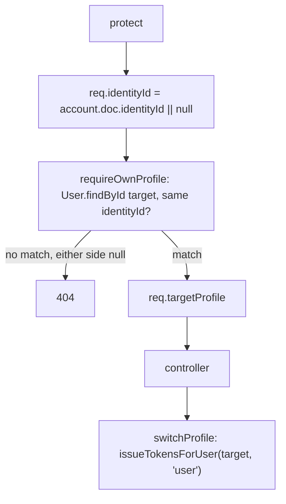

# PROFILES — TrackMe Backend

Multiple rider profiles under one account — an account holder plus the riders they manage (a
parent's children, an office's staff). One `User` collection, no per-category tables; the
"Student" / "Employee" tag is derived, never stored.

**Status:** `SHIPPED`

**Consumed by:** `user-app` (the profile switcher, `docs/modules/RIDER_PROFILES.md`) and
`web-admin` (the manager's enrollment-request queue shows the owning account for a managed
profile — `docs/modules/ACCOUNTS.md`).

---

## 1. Purpose

Extend the [`AUTH.md`](AUTH.md) identity model so one `Identity` (one email, one login) may hold
**several `User` profiles**, not just one. Every other account type (`Driver`, `Manager`,
`SuperAdmin`) stays one-per-identity — this is a `User`-only exception. The account holder's own
profile is `profileKind: 'PRIMARY'`; everyone they add is `'MANAGED'` — a rider with no login,
email, or credentials of its own, reached only by switching the active session to it.

The hard constraint: **`profileKind` must decide the login deterministically.** Before this
module, `identityRegistry.findProfilesForIdentity` resolved a person's `User` profile with
`model.findOne({ identityId })` and no sort — safe when at most one existed. The moment a second
profile can share an `identityId`, that lookup becomes non-deterministic (MongoDB natural order),
which could hand a parent their child's session. `accountRegistry.loginFilterForRole('user')`
(`{ profileKind: { $ne: 'MANAGED' } }`) is what makes it deterministic again, and it shipped
*before* the schema change that made it necessary — see §9.

## 2. API surface

All under `/api/profiles` (`src/routes/profileRoutes.js`), `protect, requireUser` throughout.

| Method | Path | Auth | Controller fn | Notes |
|---|---|---|---|---|
| `GET` | `/` | `requireUser` | `listProfiles` | Every profile on the caller's identity + an `account` block (email, primary's phone/name). |
| `GET` | `/:id/avatar` | `requireOwnProfile` | `getProfileAvatar` | Off the list response — see §8. |
| `POST` | `/` | `requirePrimaryProfile` | `createProfile` | `{name, relation?, phoneNumber?, avatarUrl?}`. Only the account holder adds a profile. |
| `PATCH` | `/:id` | `requireOwnProfile` | `updateProfileById` | `{name?, relation?, avatarUrl?}` — **not** `phoneNumber`, see §6. |
| `DELETE` | `/:id` | `requirePrimaryProfile` + `requireOwnProfile` | `removeProfile` | Soft delete. 409 `CANNOT_DELETE_PRIMARY` on the account holder's own profile. |
| `POST` | `/:id/switch` | `requireOwnProfile` | `switchProfile` | Issues a fresh token pair for the target profile. 403 if it's deactivated. |
| `GET` | `/household/enrollments` | `requireUser` | `enrollmentController.getHouseholdEnrollments` | Every profile's own `DriverEnrollment` rows, each carrying a derived `riderTag`. |

## 3. Key files (one job each)

| File | Responsibility |
|---|---|
| `src/routes/profileRoutes.js` | Route table + guard wiring. |
| `src/controllers/profileController.js` | list/create/update/delete/switch. |
| `src/controllers/enrollmentController.js` | `getHouseholdEnrollments` + the shared `loadEnrollmentsByProfile` batch loader (also used by `getMyEnrollments`). |
| `src/models/User.js` | `profileKind`, `relation`, `deletedAt`, and the PRIMARY-scoped unique index — see §4. |
| `src/models/shared/accountFields.js` | The `multiplePerIdentity` option `User` alone passes. |
| `src/middleware/auth.js` | `req.identityId` (set by `protect`/`optionalAuth`), `requireOwnProfile`, `requirePrimaryProfile`. |
| `src/utils/identityRegistry.js` | `findHouseholdProfiles` — every profile on an identity, PRIMARY first. |
| `src/utils/accountRegistry.js` | `loginFilterForRole` — the fix described in §1. |
| `src/utils/riderTag.js` | `riderTagForServiceType` — `SCHOOL`/`UNIVERSITY` → `STUDENT`, `OFFICE` → `EMPLOYEE`, else `PASSENGER`. |
| `src/utils/pushHelper.js` | `resolvePushTokensForRider` — unions push tokens across a household so a boarding push for a MANAGED profile reaches the account holder's device. |
| `src/utils/avatar.js` | Shared base64 data-URL validation (regex + byte-length), reused by the MANAGED-profile 512 KB cap here and the PRIMARY 2 MB cap in `authController`. |
| `src/utils/tokens.js`, `src/utils/accountPayload.js` | `issueTokensForUser` / `userPayload` — shared with `authController` so `switchProfile`'s response is byte-for-byte the same shape login already returns. |
| `scripts/migrate-rider-profiles.js` | Backfills `profileKind` on pre-existing `User` documents and rebuilds the indexes — see §8. |

## 4. Data model

| Model | Key fields | Indexes / invariants |
|---|---|---|
| `User` | `profileKind: 'PRIMARY' \| 'MANAGED'` (default `'PRIMARY'`), `relation` (free text, e.g. "Daughter", "Staff" — no enum, not school-specific), `deletedAt` | `identityId_1_primary_unique`: unique, `partialFilterExpression: { identityId: {$type:'objectId'}, profileKind:'PRIMARY' }` — at most one account holder per identity. A second plain `identityId_1` index (non-unique) backs the household lookups. `email`: sparse-unique — a PRIMARY carries the mirrored `Identity.email`; a MANAGED carries none. |

Two invariants enforced by a `pre('validate')` hook on `User` (not a path validator — a path
validator only runs when the field already has a value, so it would never catch a PRIMARY created
with *no* email at all):
- A `PRIMARY` profile **must** carry an email.
- A `MANAGED` profile **must not**.

**The sparse-index null trap.** `sparse: true` skips *missing* fields but still indexes an
explicit `null` — two MANAGED profiles both written with `email: null` would collide. Every write
here uses `$unset`, never `$set: { email: null }`; the Mongoose setter on `email` (accountFields.js)
turns `''` into `undefined` for the same reason.

## 5. Request flow

## 6. Authorization & security rules

- `requireOwnProfile` compares `String(target.identityId) !== String(req.identityId)` **after**
  an explicit `Boolean(req.identityId)` check — never a bare equality. `String(undefined) ===
  String(undefined)` is `'undefined' === 'undefined'`, true, which would let two pre-migration
  accounts (neither with an `identityId`) read each other's profiles. Locked directly by
  `tests/integration/require-own-profile.test.js`'s "never matches on two missing identityIds"
  case — the same discipline is repeated at every other place this module touches an authz
  decision by identity (attendance, the shared-email guard).
- 404, not 403, for "not yours" — matches `enrollmentController.leaveEnrollment`'s existing
  convention; a profile id is opaque to the caller either way.
- `requirePrimaryProfile` gates `POST /` and `DELETE /:id` — only the account holder reshapes the
  household. `PATCH /:id` does **not** require it: a MANAGED profile editing itself once switched
  in, or the PRIMARY editing any member from its own session, are both legitimate.
- `PATCH /:id` deliberately excludes `phoneNumber`. That field is set once at creation
  (`POST /`) and from then on only `PUT /api/auth/profile` changes it — and only for whichever
  profile is currently *active*, and `authController.updateProfile` ignores the field outright
  when `req.user.profileKind === 'MANAGED'`. One field, one route, so there's no way for two
  differently-validated write paths to disagree about what a MANAGED profile's phone is allowed
  to be.
- `attendanceController.getStudentAttendance` grants access to `isSelf`, a manager who manages
  the rider's fleet, **or** anyone sharing the target's `identityId` — the same
  `Boolean(req.identityId) &&` discipline as `requireOwnProfile`.
- `notificationController`'s reads are household-scoped by default (`resolveScopedUserIds`),
  narrowable via `?profileId=` — which is checked against the household, never trusted from the
  client outright.
- `socket/socketHandler.js` auto-joins `student:<id>` for **every** profile in a `role: 'user'`
  connection's household, not just the token's own profile, so an attendance event for a
  switched-out MANAGED profile still reaches the connection.

## 7. Side effects

| Effect | Trigger | Detail |
|---|---|---|
| Push | boarding scan (`boardingController`) | `pushHelper.resolvePushTokensForRider` unions tokens across the scanned rider's whole household — a MANAGED profile has no device of its own. |
| Notification | `POST /device-token` | Always writes to the identity's **PRIMARY** profile, never whichever profile is currently active — see §6. |
| Cascade | `DELETE /:id` | Soft delete (`isActive:false`, `deletedAt`, `qrTokenVersion` bumped to revoke any issued QR pass) + `DriverEnrollment.deleteMany({userId})`. **Never** touches `BoardingEvent` — attendance is a record, not a UI convenience. |

## 8. Not visible in the API surface

- **Avatars are capped tighter for MANAGED profiles: 512 KB, not the PRIMARY's 2 MB.**
  `GET /api/profiles` returns `hasAvatar: boolean` only — a household of six profiles inlining
  full 2 MB avatars would be a double-digit-MB response on mobile. The avatar itself is a
  separate `GET /:id/avatar` call.
- **A household is capped at 20 profiles** (`HOUSEHOLD_LIMIT` in `profileController.js`) — a
  sanity ceiling against a scripted caller, comfortably above any real family or small office.
- **`scripts/migrate-rider-profiles.js`** is a real migration, not just a schema change: every
  pre-existing `User` document predates `profileKind` and needs `PRIMARY` backfilled before the
  new indexes can be built. Dry-run by default; `--apply` commits; `--verify` re-checks. Must be
  runnable against the sandbox database — see [`SANDBOX.md`](SANDBOX.md), which seeds two MANAGED
  profiles under the sandbox rider for exactly this reason.
- **The Student/Employee tag is computed, never stored.** `riderTagForServiceType` reads the
  *enrolled driver's* `Organization.serviceType` at read time — storing it on the profile would
  duplicate a fact that already lives on the `Organization` and go stale the moment a rider moves
  from a school shuttle to an office one.

## 9. Known gotchas / regressions

- **The login-determinism fix (`loginFilterForRole`) shipped as its own commit, before the schema
  change that made it necessary**, specifically so it could be proven a no-op against the
  single-profile-per-identity suites that existed at the time (`auth.test.js`,
  `account-registry.test.js` pass unchanged). If you're chasing a bug where the wrong profile
  seems to be signing in, check this filter first — it's `{ profileKind: { $ne: 'MANAGED' } }`,
  not `{ profileKind: 'PRIMARY' }`, deliberately, so it also matches documents written before the
  field existed (pre-migration, or pre-`--apply`).
- **Live vehicle tracking has no backend producer right now** (see `REALTIME.md`) — the household
  read this module adds (`GET /household/enrollments`) is real and returns real enrollment data,
  but there is no live position to attach to it yet. `user-app`'s map screen has the plumbing
  (`lib/profileColors.ts`) but nothing to render.

## 10. Tests covering this module

| Layer | File | What it locks |
|---|---|---|
| Unit | `tests/unit/account-login-filter.test.js` | `loginFilterForRole`. |
| Unit | `tests/unit/migrate-rider-profiles.test.js` | The migration's pure planning helpers. |
| Integration | `tests/integration/user-profile-schema.test.js` | The six schema invariants (PRIMARY uniqueness, email required/forbidden by kind, MANAGED profiles coexisting). |
| Integration | `tests/integration/migrate-rider-profiles.test.js` | A live run of the migration against a hand-built legacy index shape — dry-run vs `--apply`, index rebuild, idempotency, `--verify` catching a corrupted duplicate PRIMARY. |
| Integration | `tests/integration/require-own-profile.test.js` | `requireOwnProfile` / `requirePrimaryProfile`, including the null-equality regression directly. |
| Integration | `tests/integration/auth-managed-profile.test.js` | A hand-signed MANAGED-profile token proves `getMe`/`updateProfile`/`updateAvatar`/`refresh-token` all report the account holder's email and that `updateProfile` ignores `phoneNumber`. |
| Integration | `tests/integration/profiles.test.js` | The full `/api/profiles` CRUD + switch + household-enrollments surface, happy paths and authz failures. |
| Integration | `tests/integration/push-helper-household.test.js` | `resolvePushTokensForRider` reaching the account holder for a MANAGED scan. |
| Integration | `tests/integration/notifications-household.test.js` | Household-scoped reads, `?profileId=`, device-token landing on PRIMARY. |
| Integration | `tests/integration/attendance-household.test.js` | Cross-profile attendance access + its own null-equality regression case. |
| Integration | `tests/integration/manager-enrollments-managed-profile.test.js` | The manager queue's `passenger.account` block for a MANAGED passenger. |
| Integration | `tests/integration/manager-shared-identity-email.test.js` | Confirms MANAGED profiles never inflate `superAdminController`'s shared-email guard. |
| WS | `tests/integration/ws/household-socket.test.js` | A PRIMARY connection auto-joins every household profile's `student:<id>` room. |

Canonical matrix: [`../TESTING_GUIDE.md`](../TESTING_GUIDE.md).

## 11. Change protocol

See [`_MODULE_TEMPLATE.md`](../guides/_MODULE_TEMPLATE.md) §11. This module's response shapes are
consumed by `user-app` (`docs/modules/RIDER_PROFILES.md`) and `web-admin`
(`docs/modules/ACCOUNTS.md`) — a shape change here updates both in the same PR.
