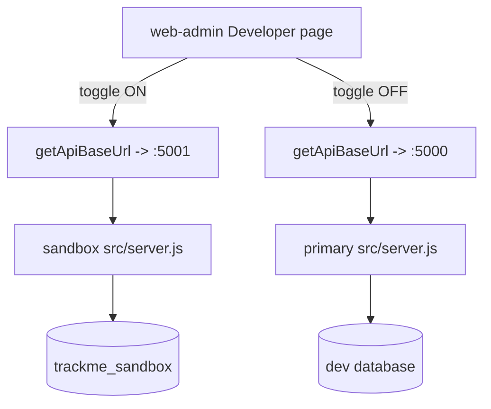

# SANDBOX — TrackMe Backend

**Status:** `SHIPPED` — Phase 1 of Developer Mode. Second backend process, own database, manual
seed/reset. See [`../../../DEVELOPER_MODE_PLAN.md`](../../../DEVELOPER_MODE_PLAN.md) for the full
design and the "Locked decisions" this module must not deviate from.

**Consumed by:** web-admin's Developer page — [`../../web-admin/docs/modules/DEVELOPER_MODE.md`](../../../web-admin/docs/modules/DEVELOPER_MODE.md).

---

## 1. Purpose

Manual CRUD verification had nowhere safe to happen — the only running database was the real
one. This module is a second, disposable backend process on `:5001` against a `*_sandbox`
database with identical schema, so a developer can exercise create/update/delete destructively
without touching real data. It shares the dev backend's `JWT_SECRET` and mirrors the dev
superadmin's `_id`, so one login session works against both processes.

## 2. API surface

No new routes. The sandbox process runs the exact same `src/server.js` and route table as the
primary backend — the only difference is which `MONGODB_URI`/`PORT` it was started with. The one
addition to an existing route is `GET /health`, which now also reports `mode` (`sandbox` when the
connected database name contains `sandbox`, else `primary`) and `dbName`.

## 3. Key files (one job each)

| File | Responsibility |
|---|---|
| `package.json` (`dev:sandbox`) | `nodemon --require dotenv/config src/server.js dotenv_config_path=.env.sandbox` — preloads `.env.sandbox` before `src/server.js`'s own `require('dotenv').config()` runs, and dotenv never overrides an already-set var, so the sandbox file wins. |
| `.env.sandbox.example` | Template: `PORT=5001`, a `*_sandbox` `MONGODB_URI`, the same `JWT_SECRET` as dev, and `SANDBOX_MIRROR_SUPERADMIN_ID`. |
| `scripts/seed-sandbox.js` (`npm run seed:sandbox`) | Wipes and reseeds the sandbox database. Hard-guarded (see §6). |
| `src/server.js` (`GET /health`) | Reports `mode`/`dbName` from the live `mongoose.connection`, not from config. |

## 4. Data model

No schema changes. `scripts/seed-sandbox.js` writes ordinary documents through the same models
and the same `createIdentityWithProfile`/`Driver.create` paths as the real app — see §6.

## 5. Request flow

Two full processes running the same code, never one process branching per-request — see the
plan's "Rejected" note for why a per-request connection switch was not used.

## 6. Authorization & security rules

- `scripts/seed-sandbox.js` reads the database name off `MONGODB_URI` and `process.exit(1)`
  unless it contains `sandbox`. This script wipes every account/fleet/booking collection; it must
  stay structurally incapable of running against dev or prod, whatever env file is loaded — see
  `dbNameFromUri` + `assertSandboxDatabase`.
- The sandbox superadmin is created with an **explicit mirrored `_id`**
  (`SANDBOX_MIRROR_SUPERADMIN_ID`), because `middleware/auth.js`'s `protect` resolves
  `findAccountById(decoded.id, decoded.role)` by profile `_id`. Mirroring that one id is what lets
  a dev-issued JWT authenticate on the sandbox backend too.
- Seed **before** the sandbox server's first boot: `ensureSuperAdminAccount` no-ops once
  `SuperAdmin.countDocuments() > 0`, so seeding first is what stops it minting a second,
  random-`_id` superadmin that would break the shared token.
- `.env.sandbox` is gitignored; only `.env.sandbox.example` is committed.

## 7. Side effects

None beyond the normal app (push/email/socket side effects still fire from the sandbox process
against whatever real third-party keys are in `.env.sandbox` — leave those blank unless you are
deliberately exercising that path).

## 8. Not visible in the API surface

- Drivers have no `Identity` (driver-code sign-in, see `src/models/Driver.js`) — the seed script
  creates them via `Driver.create` directly, not `createIdentityWithProfile`, mirroring
  `managerDriversController.createManagerDriver`.
- `seed-sandbox.js` calls `Model.syncIndexes()` for every model before wiping, so a sandbox
  database left over from an older schema version (e.g. a once-required index that is now sparse)
  doesn't throw a stale duplicate-key error on reseed.
- Fixtures: 1 superadmin (mirrored `_id`), 2 managers, 4 drivers, 5 routes, 6 vehicles, 1 sandbox
  rider (PRIMARY) + 2 managed rider profiles under the same identity (`seedManagedProfiles`,
  created directly via `User.create` — a managed profile has no login to attach, so it doesn't go
  through `createIdentityWithProfile`), 12 bookings, 3 pending manager vehicle requests. See
  [`PROFILES.md`](PROFILES.md).

## 9. Known gotchas / regressions

- **Schema and CRUD changes must work in sandbox.** A new model, field, or endpoint ships with
  its `scripts/seed-sandbox.js` fixture updated in the same change. Any migration must be runnable
  against the sandbox database. (Also recorded in `../QA_UPDATE_TRIGGERS.md` and `../../CLAUDE.md`.)
- If `.env.sandbox`'s `JWT_SECRET` ever drifts from dev's, a dev-issued token will fail on
  sandbox with a plain 401 — there is no more specific error surfaced for this case.

## 10. Tests covering this module

None in Phase 1 by design — see the plan's "New tests: Not in phase 1" locked decision. The
guard logic (`dbNameFromUri`) is simple enough to have been verified by hand against
`trackme_sandbox` (accepted) and `test`/`trackme` (refused) during implementation; a dedicated
unit test is a natural Phase 2 addition once the script is extracted into a testable module
instead of a top-level script.

## 11. Change protocol

Any change to this module must:
1. Confirm `npm run seed:sandbox` still refuses a non-`sandbox` `MONGODB_URI` and still succeeds
   against a real `*_sandbox` database.
2. Keep `dev:sandbox`'s dotenv-preload trick intact — do not add a second `require('dotenv')`
   call anywhere in the startup path ahead of it.
3. Update this doc + the `TESTING_GUIDE.md` row if one is added, and append a `CHANGES.md` entry
   before pushing.
4. If a new model/field ships, update `scripts/seed-sandbox.js`'s fixtures in the same change.
